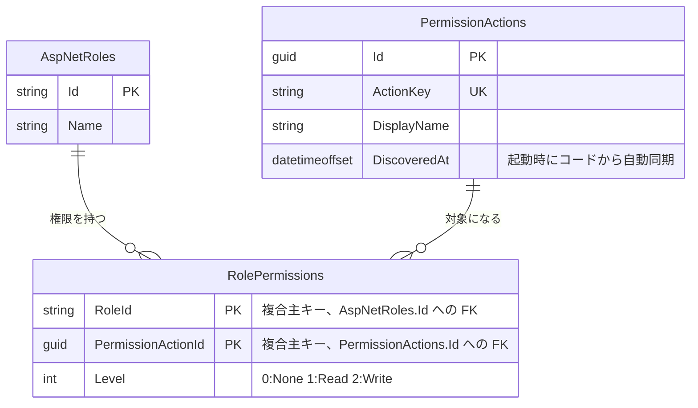

# admin-roles(ロール管理)

## 概要

ロールの作成・名称変更・削除と、ロールごとのAPI権限(`PermissionAction` 単位の `PermissionLevel`)の設定を扱う。権限キー `Admin.Roles` への `Write` 権限を持つことそのものを管理者の定義とする([decisions/0001](../../decisions/0001-role-based-authorization-design.md))。`PermissionAction` は `[PermissionKey]` 属性を持つAPIから起動時に自動同期されるカタログで、このドメインからは読み取り専用。

## ER図

`RolePermissions` はロール削除・権限アクション廃止に追随して `ON DELETE CASCADE` で削除される(`AuthDbContext.OnModelCreating`)。

## 画面操作とCRUD対応

| 画面 | 操作 | API | CRUD | 対象テーブル |
|---|---|---|---|---|
| `admin/roles/` | ロール一覧・権限マトリクスの表示 | `GET /api/admin/roles` | Read | `AspNetRoles`, `RolePermissions`, `PermissionActions` |
| `admin/roles/` | 権限アクション一覧の表示 | `GET /api/admin/roles/permission-actions` | Read | `PermissionActions` |
| `admin/roles/`(新規ロール名フォーム) | ロール作成 | `POST /api/admin/roles` | Create | `AspNetRoles` |
| `admin/roles/`(ロール名フォーム、「名称を変更」) | ロール名変更 | `PUT /api/admin/roles/{roleId}` | Update | `AspNetRoles` |
| `admin/roles/`(「ロールを削除」) | ロール削除 | `DELETE /api/admin/roles/{roleId}` | Delete | `AspNetRoles`(`RolePermissions` もカスケード削除) |
| `admin/roles/`(権限マトリクス、「権限を保存」) | ロールの権限を設定(全置換) | `PUT /api/admin/roles/{roleId}/permissions` | Delete + Create | `RolePermissions` |
