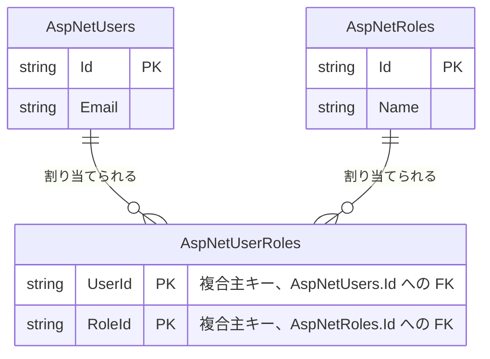

# admin-user-roles(ユーザーへのロール割り当て)

## 概要

個別ユーザーに対するロールの割り当て・解除を扱う。権限キー `Admin.UserRoles` への `Write` 権限を持つユーザーだけが変更でき、一般ユーザーは自分自身に対してもこのAPIを呼び出せない。ロールの一括差し替えは `RemoveFromRolesAsync`/`AddToRolesAsync` を明示的なトランザクションで囲んで行う([decisions/0002](../../decisions/0002-explicit-transactions-for-multi-step-writes.md))。

## ER図

`AspNetUserRoles` は ASP.NET Core Identity 標準の多対多中間テーブルで、アプリ独自の割り当てエンティティは追加していない。

## 画面操作とCRUD対応

| 画面 | 操作 | API | CRUD | 対象テーブル |
|---|---|---|---|---|
| `admin/users/[userId]/roles/` | ロール候補一覧の表示 | `GET /api/admin/roles` | Read | `AspNetRoles` |
| `admin/users/[userId]/roles/` | 対象ユーザーの保持ロール表示 | `GET /api/admin/users/{userId}/roles` | Read | `AspNetUserRoles` |
| `admin/users/[userId]/roles/`(チェックボックス+「保存」) | ロール割り当ての一括更新(差分Add/Remove) | `PUT /api/admin/users/{userId}/roles` | Update | `AspNetUserRoles` |
