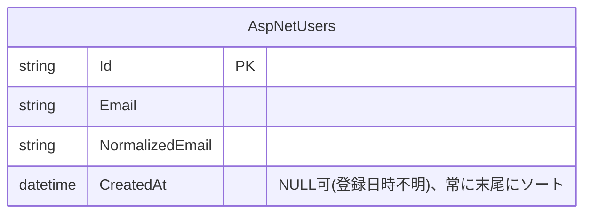

# admin-users(ユーザー一覧)

## 概要

数千件規模を想定した、全ユーザーのメールアドレス・登録日時の検索・並び替え・ページングを扱う。ロール割り当て([admin-user-roles](admin-user-roles.md))より広い情報を開示するため、別の権限キー `Admin.Users` を用いる([decisions/0004](../../decisions/0004-admin-user-list-design.md)、検索オプションは [decisions/0005](../../decisions/0005-user-list-email-search-options.md))。読み取り専用で、このドメインに更新操作はない。

## ER図

## 画面操作とCRUD対応

| 画面 | 操作 | API | CRUD | 対象テーブル |
|---|---|---|---|---|
| `admin/users/` | 一覧表示・メールアドレス検索(前方一致・大文字小文字区別オプション付き)・並び替え・ページング | `GET /api/admin/users?...` | Read | `AspNetUsers` |
| `admin/users/`(「ロールを編集」リンク) | [admin-user-roles](admin-user-roles.md) 画面への遷移 | - | - | - |
