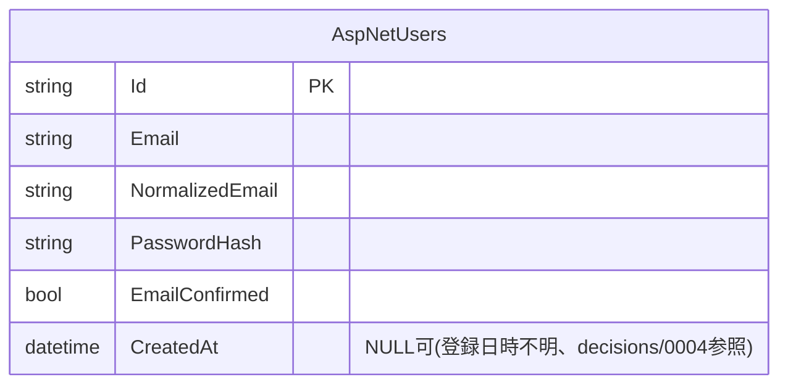

# auth(認証)

## 概要

アカウント登録・メールアドレス確認・ログイン/ログアウトと、ログイン中ユーザーの実効権限取得を扱う。権限キーによる保護対象ではなく、`GET /api/auth/me` のみ `[Authorize]` で保護する(それ以外は未ログインでも呼べる)。実効権限の算出方法は [decisions/0003](../../decisions/0003-expose-effective-permissions-in-me.md) を参照。

## ER図

`GET /api/auth/login`・`GET /api/auth/me` が返す実効権限マップは `AspNetUserRoles`・`RolePermissions`・`PermissionActions` を横断して算出する(参照のみ、このドメインでは更新しない)。テーブルの詳細は [admin-roles](admin-roles.md)・[admin-user-roles](admin-user-roles.md) を参照。

## 画面操作とCRUD対応

| 画面 | 操作 | API | CRUD | 対象テーブル |
|---|---|---|---|---|
| `signup/` | アカウント登録 | `POST /api/auth/register` | Create | `AspNetUsers` |
| `login/` | ログイン | `POST /api/auth/login` | Read | `AspNetUsers`(+実効権限算出のため `AspNetUserRoles`/`RolePermissions`/`PermissionActions` を参照) |
| `login/` | 確認メール再送 | `POST /api/auth/resend-confirmation` | Read | `AspNetUsers` |
| `confirm-email/` | メールアドレス確認 | `POST /api/auth/confirm-email` | Update | `AspNetUsers`(`EmailConfirmed`) |
| `+layout.svelte`(全画面共通) | ログイン状態確認 | `GET /api/auth/me` | Read | `AspNetUsers`(+実効権限算出のため `AspNetUserRoles`/`RolePermissions`/`PermissionActions` を参照) |
| `+page.svelte`(トップ画面) | ログアウト | `POST /api/auth/logout` | - | DB操作なし(Cookie の失効のみ) |
| 各画面の更新操作の直前 | CSRFトークン取得 | `GET /api/auth/csrf` | - | DB操作なし |
