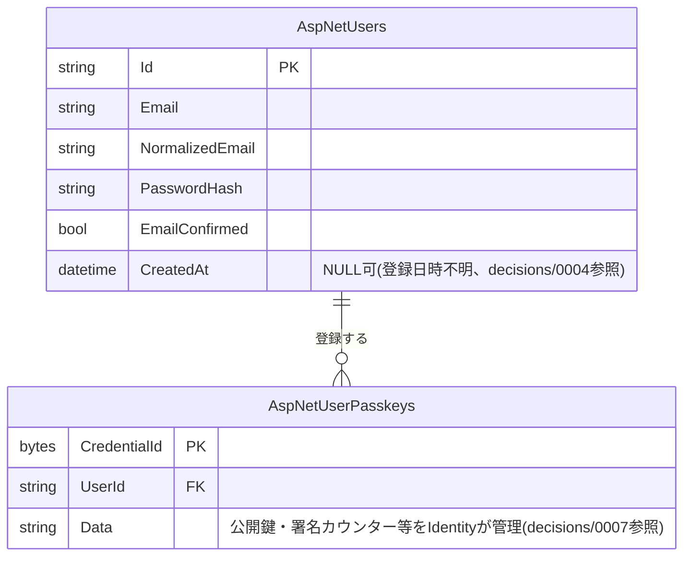

# auth(認証)

## 概要

アカウント登録・メールアドレス確認・パスワード再設定・パスキー(WebAuthn)・ログイン/ログアウトと、ログイン中ユーザーの実効権限取得を扱う。権限キーによる保護対象ではなく、`GET /api/auth/me` とパスキーの登録・一覧・削除系エンドポイント(`/api/auth/passkeys`・`/api/auth/passkeys/registration-options`・`/api/auth/passkeys/{credentialId}`)のみ `[Authorize]` で保護する(それ以外は未ログインでも呼べる。パスキーのログイン系エンドポイントは未ログイン状態で使うため保護しない)。実効権限の算出方法は [decisions/0003](../../decisions/0003-expose-effective-permissions-in-me.md) を参照。パスキーの設計判断は [decisions/0007](../../decisions/0007-passkey-authentication-design.md) を参照。

## ER図

`AspNetUserPasskeys` は ASP.NET Core Identity 組み込みのパスキー(WebAuthn)ストアが管理するテーブルで、カスタムエンティティは定義していない([decisions/0007](../../decisions/0007-passkey-authentication-design.md)参照)。

`GET /api/auth/login`・`GET /api/auth/me` が返す実効権限マップは `AspNetUserRoles`・`RolePermissions`・`PermissionActions` を横断して算出する(参照のみ、このドメインでは更新しない)。テーブルの詳細は [admin-roles](admin-roles.md)・[admin-user-roles](admin-user-roles.md) を参照。

## 画面操作とCRUD対応

| 画面 | 操作 | API | CRUD | 対象テーブル |
|---|---|---|---|---|
| `signup/` | アカウント登録 | `POST /api/auth/register` | Create | `AspNetUsers` |
| `login/` | ログイン | `POST /api/auth/login` | Read | `AspNetUsers`(+実効権限算出のため `AspNetUserRoles`/`RolePermissions`/`PermissionActions` を参照) |
| `login/` | 確認メール再送 | `POST /api/auth/resend-confirmation` | Read | `AspNetUsers` |
| `confirm-email/` | メールアドレス確認 | `POST /api/auth/confirm-email` | Update | `AspNetUsers`(`EmailConfirmed`) |
| `forgot-password/` | パスワード再設定依頼 | `POST /api/auth/forgot-password` | Read | `AspNetUsers` |
| `reset-password/` | パスワード再設定 | `POST /api/auth/reset-password` | Update | `AspNetUsers`(`PasswordHash`・`EmailConfirmed`・`SecurityStamp`) |
| `login/` | パスキーログインの準備 | `POST /api/auth/passkeys/login-options` | Read | `AspNetUsers`・`AspNetUserPasskeys` |
| `login/` | パスキーでログイン | `POST /api/auth/passkeys/login` | Read | `AspNetUsers`・`AspNetUserPasskeys` |
| `settings/passkeys/` | パスキー登録の準備 | `POST /api/auth/passkeys/registration-options` | Read | `AspNetUsers` |
| `settings/passkeys/` | パスキー登録 | `POST /api/auth/passkeys` | Create | `AspNetUserPasskeys` |
| `settings/passkeys/` | パスキー一覧取得 | `GET /api/auth/passkeys` | Read | `AspNetUserPasskeys` |
| `settings/passkeys/` | パスキー削除 | `DELETE /api/auth/passkeys/{credentialId}` | Delete | `AspNetUserPasskeys` |
| `+layout.svelte`(全画面共通) | ログイン状態確認 | `GET /api/auth/me` | Read | `AspNetUsers`(+実効権限算出のため `AspNetUserRoles`/`RolePermissions`/`PermissionActions` を参照) |
| `+page.svelte`(トップ画面) | ログアウト | `POST /api/auth/logout` | - | DB操作なし(Cookie の失効のみ) |
| 各画面の更新操作の直前 | CSRFトークン取得 | `GET /api/auth/csrf` | - | DB操作なし |
