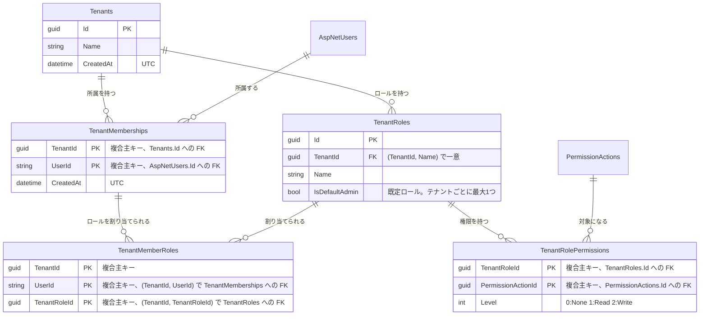

# tenants(テナント所属・テナントロール)

## 概要

ユーザーのテナント所属と、テナント内で定義するロール・権限を扱う。アカウントは全体で共通で、1ユーザーが複数のテナントに所属できる。
テナント内の API は `/api/tenants/{tenantId}` 配下に置き、所属とテナントロールの権限(`PermissionActions.Scope` が `Tenant` の権限キー)で判定する([decisions/0010](../../decisions/0010-multi-tenancy-design.md))。

`ITenantOwned` を実装したエンティティ(現在は `TenantRoles`・`TenantMemberRoles`)には、URLのテナント以外の行を返さないクエリフィルターを適用する。

テナントの作成・所属の追加と解除は運営者が行う([admin-tenants.md](admin-tenants.md))。テナント内では、`Tenant.Roles` でテナントロールを、`Tenant.MemberRoles` でメンバーへの割り当てを管理する。

既定ロール「テナント管理者」(`IsDefaultAdmin`)は全テナント用権限キーへの `Write` を常に持ち、後から追加された権限キーも起動時に補完される。削除・権限変更はできない([decisions/0011](../../decisions/0011-tenant-default-admin-role-grants.md))。

## ER図

- `TenantMemberRoles` は所属・ロールの両方へ `TenantId` を含む複合外部キーを張り、別テナントのロールを割り当てられないようにする。
- テナント削除では所属・テナントロール(とその権限)が、所属解除ではその割り当てが `ON DELETE CASCADE` で削除される。
- `TenantMemberRoles` から `TenantRoles` への外部キーは連鎖削除しない(SQL Server が連鎖削除経路の重複を拒否するため)。テナントロールの削除時は割り当てを先に削除する。

## 画面操作とCRUD対応

| 画面 | 操作 | API | CRUD | 対象テーブル |
|---|---|---|---|---|
| `/`(トップ画面) | 所属テナント一覧の表示 | `GET /api/auth/me`・`POST /api/auth/login` | Read | `TenantMemberships`, `Tenants` |
| `t/{tenantId}/` | テナントでの自分の実効権限の取得 | `GET /api/tenants/{tenantId}/me` | Read | `Tenants`, `TenantMemberships`, `TenantMemberRoles`, `TenantRolePermissions`, `PermissionActions` |
| `t/{tenantId}/settings/roles/` | テナントロール一覧・権限マトリクスの表示 | `GET /api/tenants/{tenantId}/roles` | Read | `TenantRoles`, `TenantRolePermissions`, `PermissionActions` |
| `t/{tenantId}/settings/roles/` | テナント用権限キー一覧の表示 | `GET /api/tenants/{tenantId}/roles/permission-actions` | Read | `PermissionActions` |
| `t/{tenantId}/settings/roles/`(新規ロール名フォーム) | テナントロール作成 | `POST /api/tenants/{tenantId}/roles` | Create | `TenantRoles` |
| `t/{tenantId}/settings/roles/`(「名称を変更」) | テナントロール名変更 | `PUT /api/tenants/{tenantId}/roles/{roleId}` | Update | `TenantRoles` |
| `t/{tenantId}/settings/roles/`(「ロールを削除」) | テナントロール削除(既定ロールは不可) | `DELETE /api/tenants/{tenantId}/roles/{roleId}` | Delete | `TenantMemberRoles`(明示削除)、`TenantRoles`(`TenantRolePermissions` はカスケード削除) |
| `t/{tenantId}/settings/roles/`(「権限を保存」) | テナントロールの権限を設定(全置換、既定ロールは不可) | `PUT /api/tenants/{tenantId}/roles/{roleId}/permissions` | Delete + Create | `TenantRolePermissions` |
| `t/{tenantId}/settings/members/` | ロール名一覧・メンバーの表示 | `GET /api/tenants/{tenantId}/members` | Read | `TenantRoles`, `TenantMemberships`, `TenantMemberRoles`, `AspNetUsers` |
| `t/{tenantId}/settings/members/`(「ロールを保存」) | メンバーのテナントロールを設定(全置換) | `PUT /api/tenants/{tenantId}/members/{userId}/roles` | Delete + Create | `TenantMemberRoles` |
| (画面なし、起動時) | 既定ロールへの全テナント用権限の補完 | `PermissionActionSync` | Create + Update | `TenantRolePermissions` |
