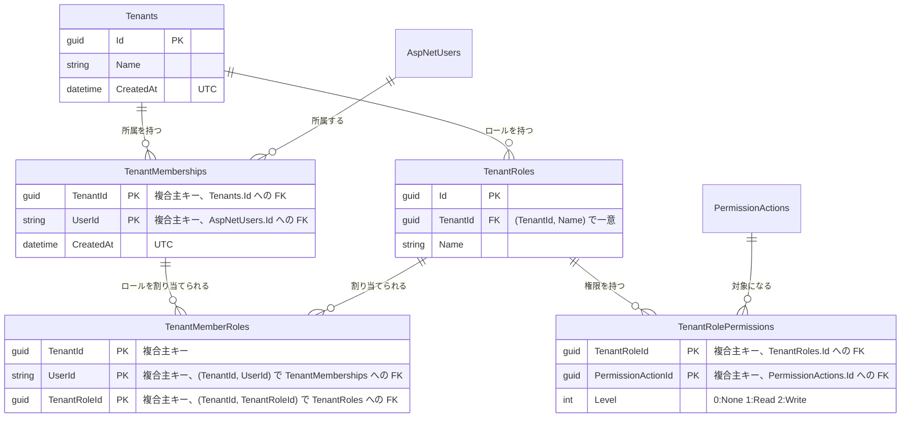

# tenants(テナント所属・テナントロール)

## 概要

ユーザーのテナント所属と、テナント内で定義するロール・権限を扱う。アカウントは全体で共通で、1ユーザーが複数のテナントに所属できる。
テナント内の API は `/api/tenants/{tenantId}` 配下に置き、所属とテナントロールの権限(`PermissionActions.Scope` が `Tenant` の権限キー)で判定する([decisions/0010](../../decisions/0010-multi-tenancy-design.md))。

`ITenantOwned` を実装したエンティティ(現在は `TenantRoles`・`TenantMemberRoles`)には、URLのテナント以外の行を返さないクエリフィルターを適用する。

テナントの作成・所属の割り当て(運営者向け)と、テナントロールの編集画面は未実装。現在はデータモデルと認可基盤、自分の実効権限の取得APIのみ。

## ER図

- `TenantMemberRoles` は所属・ロールの両方へ `TenantId` を含む複合外部キーを張り、別テナントのロールを割り当てられないようにする。
- テナント削除では所属・テナントロール(とその権限)が、所属解除ではその割り当てが `ON DELETE CASCADE` で削除される。
- `TenantMemberRoles` から `TenantRoles` への外部キーは連鎖削除しない(SQL Server が連鎖削除経路の重複を拒否するため)。テナントロールの削除時は割り当てを先に削除する。

## 画面操作とCRUD対応

| 画面 | 操作 | API | CRUD | 対象テーブル |
|---|---|---|---|---|
| (未実装) | テナントでの自分の実効権限の取得 | `GET /api/tenants/{tenantId}/me` | Read | `Tenants`, `TenantMemberships`, `TenantMemberRoles`, `TenantRolePermissions`, `PermissionActions` |
